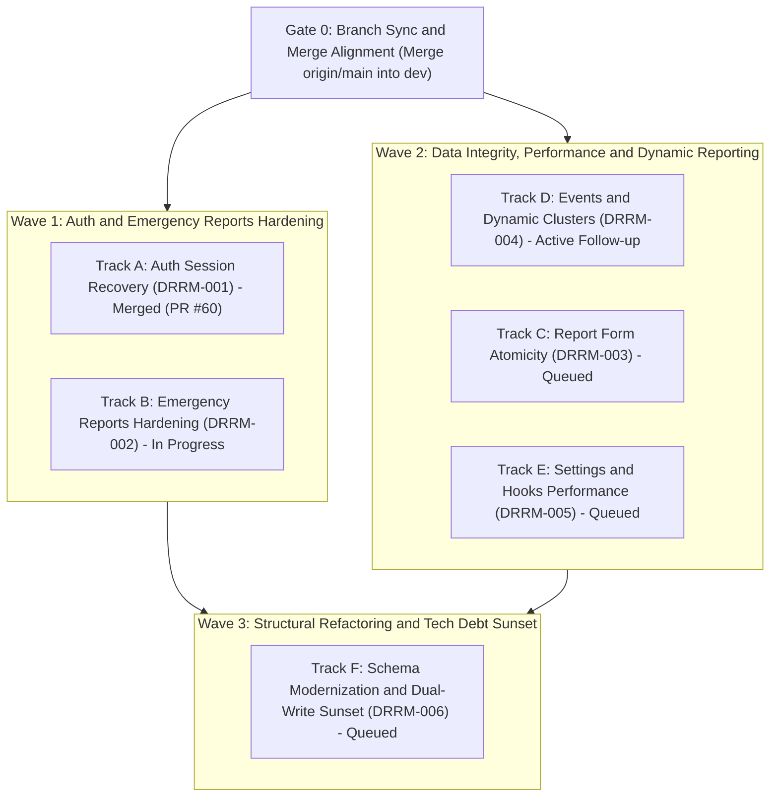
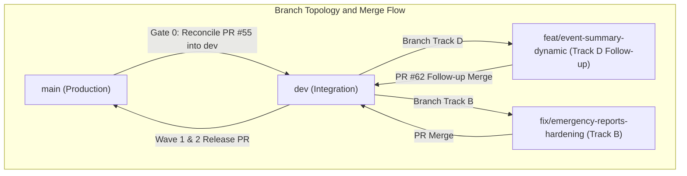

# Code Review & Audit Findings — `dev` Branch

- **Initial Audit Date:** 2026-09-08
- **Latest Revision Date:** 2026-09-11 (Post-PR #62 & Branch Sync Audit)
- **Branch:** `dev`
- **Reviewer:** Antigravity (automated deep-read audit)
- **Scope:** Architecture, correctness, security, database performance, state synchronization, type safety, multi-campus dynamic clusters, and branch divergence.
- **Status:** `[Active Remediation & Verification]`

---

## Table of Contents

1. [Critical & High-Risk Bugs](#1-critical--high-risk-bugs)
   - 1.1 [Foreign Key Constraint Violation on User Deletion](#11-foreign-key-constraint-violation-on-user-deletion)
   - 1.2 [Google OAuth User Linking Failure on Existing Accounts](#12-google-oauth-user-linking-failure-on-existing-accounts-resolved) `[Resolved]`
   - 1.3 [Stale LocalStorage Auth Profile & Account Switching Bug](#13-stale-localstorage-auth-profile--account-switching-bug-resolved) `[Resolved]`
   - 1.4 [Hardcoded `CLUSTERS` Breaks Dynamic & Multi-Campus Clusters](#14-hardcoded-clusters-breaks-dynamic--multi-campus-clusters-partially-resolved) `[Partially Resolved]`
   - 1.5 [Incorrect Active Event Count on Landing Page](#15-incorrect-active-event-count-on-landing-page)
   - 1.6 [Infinite Spinner on Undefined `eventId` in `EventSummary` (TanStack Query v5 `isPending` Trap)](#16-infinite-spinner-on-undefined-eventid-in-eventsummary-tanstack-query-v5-ispending-trap-new) `[New]`
   - 1.7 [Silent Exclusion of Historical / Inactive Cluster Reports](#17-silent-exclusion-of-historical--inactive-cluster-reports-new) `[New]`
   - 1.8 [Stale Cluster Tab State in `UnitBreakdownTabbed`](#18-stale-cluster-tab-state-in-unitbreakdowntabbed-new) `[New]`
2. [Performance & Database Optimizations](#2-performance--database-optimizations)
   - 2.1 [Unbounded In-Memory Aggregation in `getReportClusterSummary`](#21-unbounded-in-memory-aggregation-in-getreportclustersummary)
   - 2.2 [N+1 Roundtrips in `getCampusHeadcountPerEvent`](#22-n1-roundtrips-in-getcampusheadcountperevent)
   - 2.3 [Full Users Table Downloaded for Dashboard Stat Card](#23-full-users-table-downloaded-for-dashboard-stat-card)
   - 2.4 [Two-Query Status Lookup in `getOngoingEvents`](#24-two-query-status-lookup-in-getongoingevents)
   - 2.5 [Redundant `getCampusEvents` Sequential Queries](#25-redundant-getcampusevents-sequential-queries)
   - 2.6 [Redundant Linear Filtering in `ClusterSummaryChart`](#26-redundant-linear-filtering-in-clustersummarychart-new) `[New]`
3. [Cache & Route Fixes](#3-cache--route-fixes)
   - 3.1 [Wrong `revalidatePath` in Emergency Report Status Update](#31-wrong-revalidatepath-in-emergency-report-status-update)
   - 3.2 [`useCampus` Hook Does Not Invalidate `campuses` List Key](#32-usecampus-hook-does-not-invalidate-campuses-list-key)
   - 3.3 [Case-Sensitive Badge Status Comparison](#33-case-sensitive-badge-status-comparison)
   - 3.4 [ERT Report Page Copy Typo](#34-ert-report-page-copy-typo)
4. [Schema Design Issues](#4-schema-design-issues)
   - 4.1 [Inconsistent Model Naming Convention](#41-inconsistent-model-naming-convention)
   - 4.2 [`campus` Model Missing `@@map` and Audit Timestamps](#42-campus-model-missing-map-and-audit-timestamps)
   - 4.3 [`bystander_reports` Missing Index on `cluster_id`](#43-bystander_reports-missing-index-on-cluster_id)
   - 4.4 [`Report` Model Retains Legacy Flat Headcount Columns](#44-report-model-retains-legacy-flat-headcount-columns)
5. [Emergency Reports — Additional Bugs](#5-emergency-reports--additional-bugs)
   - 5.1 [`status_id` Can Be `undefined` on Bystander Report Create](#51-status_id-can-be-undefined-on-bystander-report-create)
   - 5.2 [`revalidatePath` Inconsistency Across Emergency Report Mutations](#52-revalidatepath-inconsistency-across-emergency-report-mutations)
   - 5.3 [No Authorization Guard on Bystander Report Mutations](#53-no-authorization-guard-on-bystander-report-mutations)
6. [Settings Actions — Structural Weaknesses](#6-settings-actions--structural-weaknesses)
   - 6.1 [Dynamic Model Access Suppresses Type Errors](#61-dynamic-model-access-suppresses-type-errors)
   - 6.2 [`singularLabel` Regex Incorrectly Strips Final `s` from `campus`](#62-singularlabel-regex-incorrectly-strips-final-s-from-campus)
   - 6.3 [`getSettingsItems` Returns All Records Without Pagination](#63-getsettingsitems-returns-all-records-without-pagination)
7. [Report Form — Atomicity & Correctness](#7-report-form--atomicity--correctness)
   - 7.1 [Multi-RPC Mutation Blast Is Not Atomic](#71-multi-rpc-mutation-blast-is-not-atomic)
   - 7.2 [`profileClusterId` Silently Overrides Form-Entered Cluster](#72-profileclusterid-silently-overrides-form-entered-cluster)
   - 7.3 [`upsertDamageCondition` Called Inside Submit Handler Can Create Orphan Rows](#73-upsertdamagecondition-called-inside-submit-handler-can-create-orphan-rows)
8. [Auth Flow — Detailed Analysis](#8-auth-flow--detailed-analysis)
   - 8.1 [`ProtectedRoute` Has an Infinite-Spinner Edge Case](#81-protectedroute-has-an-infinite-spinner-edge-case-resolved) `[Resolved]`
   - 8.2 [`lastUserIdRef` Is Declared But Never Written](#82-lastuseridref-is-declared-but-never-written-resolved) `[Resolved]`
   - 8.3 [`ADMIN_USER_TYPES` Constant Is Duplicated](#83-admin_user_types-constant-is-duplicated)
9. [Type Safety & Code Quality](#9-type-safety--code-quality)
   - 9.1 [`getUser(id!)` Non-Null Assertion in `useUser` Hook](#91-getuserid-non-null-assertion-in-useuser-hook)
   - 9.2 [`ReportCasualty.report_id` Is Nullable Without DB Constraint](#92-reportcasualtyreport_id-is-nullable-without-db-constraint)
   - 9.3 [`Decimal` Latitude/Longitude Serialized Inconsistently](#93-decimal-latitudelongitude-serialized-inconsistently)
   - 9.4 [`useCampus(campusId)` Hook Ignores Its Argument](#94-usecampuscampusid-hook-ignores-its-argument)
   - 9.5 [`eventSchema` Contains a Dead `location_id` Field](#95-eventschema-contains-a-dead-location_id-field)
   - 9.6 [Stray JSX Whitespace Nodes `{' '}` in Admin Views](#96-stray-jsx-whitespace-nodes---in-admin-views-new) `[New]`
10. [Legacy Dual-Write Shim Risk](#10-legacy-dual-write-shim-risk)
11. [Git Branch Divergence Alert (`main` vs `dev`)](#11-git-branch-divergence-alert-main-vs-dev-new) `[New]`
12. [Prioritized Remediation Checklist](#12-prioritized-remediation-checklist)
13. [Execution Roadmap & Distribution](#13-execution-roadmap--distribution)
    - 13.1 [Phased Delivery Waves & Dependency Flow](#131-phased-delivery-waves--dependency-flow)
    - 13.2 [Detailed Track Distribution Matrix](#132-detailed-track-distribution-matrix)
    - 13.3 [Branch Workflow & Pull Request Governance](#133-branch-workflow--pull-request-governance)

---

## 1. Critical & High-Risk Bugs

### 1.1 Foreign Key Constraint Violation on User Deletion

- **File:** [`src/actions/users/index.ts:181-199`](file:///C:/Users/jomar/orca/workspaces/drrmh-irs/dev/src/actions/users/index.ts#L181-L199)
- **Status:** `[Pending / Open]`
- **Problem:** `deleteUser(id)` nullifies `report.user_id` but neglects `event.user_id`. In `schema.prisma`, `Event.user` is declared with `onDelete: NoAction`:
  ```prisma
  user User? @relation("CreatedBy", fields: [user_id], references: [id], onDelete: NoAction, onUpdate: NoAction)
  ```
  When the user has created events, Postgres rejects the `DELETE` with error `P2003`.
- **Impact:** Any user who has ever created an event cannot be deleted.
- **Fix:**
  ```ts
  // Nullify both relations before deleting the user
  await prisma.event.updateMany({ where: { user_id: id }, data: { user_id: null } });
  await prisma.report.updateMany({ where: { user_id: id }, data: { user_id: null } });
  await prisma.user.delete({ where: { id } });
  ```

---

### 1.2 Google OAuth User Linking Failure on Existing Accounts `[Resolved]`

- **File:** [`src/actions/auth/index.ts:53-89`](file:///C:/Users/jomar/orca/workspaces/drrmh-irs/dev/src/actions/auth/index.ts#L53-L89)
- **Status:** ✅ `[Resolved in fix/auth-session-recovery / PR #60]`
- **Resolution:** The catch block for unique constraint violation `P2002` on `email` now executes `prisma.user.update` with `data: { auth_id: authId }`, properly linking the pre-existing user row to the newly authenticated Supabase Auth account.

---

### 1.3 Stale LocalStorage Auth Profile & Account Switching Bug `[Resolved]`

- **Files:** [`src/store/auth.store.ts`](file:///C:/Users/jomar/orca/workspaces/drrmh-irs/dev/src/store/auth.store.ts), [`src/components/auth/auth-provider.tsx:45-60`](file:///C:/Users/jomar/orca/workspaces/drrmh-irs/dev/src/components/auth/auth-provider.tsx#L45-L60)
- **Status:** ✅ `[Resolved in fix/auth-session-recovery / PR #60]`
- **Resolution:** `fetchProfile(userId)` now strictly compares `userProfile.auth_id === userId` before reusing cached profile data, and `lastUserIdRef.current` is properly populated on fetch.

---

### 1.4 Hardcoded `CLUSTERS` Breaks Dynamic & Multi-Campus Clusters `[Partially Resolved]`

- **Files:** [`src/lib/constants.ts:1`](file:///C:/Users/jomar/orca/workspaces/drrmh-irs/dev/src/lib/constants.ts#L1), [`src/app/(admin)/events/details/event-summary.tsx`](<file:///C:/Users/jomar/orca/workspaces/drrmh-irs/dev/src/app/(admin)/events/details/event-summary.tsx>), [`src/app/(admin)/events/export-event.ts:65-75`](<file:///C:/Users/jomar/orca/workspaces/drrmh-irs/dev/src/app/(admin)/events/export-event.ts#L65-L75>)
- **Status:** 🔄 `[Partially Resolved in PR #62 — Follow-up Required]`
- **Current State:**
  - `event-summary.tsx` was updated to accept `campusId` and dynamically load campus clusters via `useCampusClusters(campusId)`.
  - **Remaining Debt:** [`export-event.ts:65`](<file:///C:/Users/jomar/orca/workspaces/drrmh-irs/dev/src/app/(admin)/events/export-event.ts#L65>) still iterates over the static `CLUSTERS` array (`CLUSTERS.forEach(...)`). Any report under a custom or non-default cluster is silently omitted from the Excel export's "By Cluster" sheet.
  - Furthermore, PR #62 introduced new edge cases detailed in §1.6, §1.7, and §1.8.

---

### 1.5 Incorrect Active Event Count on Landing Page

- **File:** [`src/actions/landing/index.ts:21`](file:///C:/Users/jomar/orca/workspaces/drrmh-irs/dev/src/actions/landing/index.ts#L21)
- **Status:** `[Pending / Open]`
- **Problem:**
  ```ts
  const activeEvents = events.filter((e) => e.status?.name?.toLowerCase() === 'ongoing').length;
  ```
  `events` is capped at `take: 8`. If more than 8 events exist and some ongoing ones fall outside the first 8 rows (ordered by `created_at DESC`), they are not counted.
- **Fix:** Add a dedicated count query in the `Promise.all`:
  ```ts
  const [events, totalEvents, activeEvents] = await Promise.all([
    prisma.event.findMany({ ...options, take: 8 }),
    prisma.event.count(),
    prisma.event.count({
      where: { status: { name: { equals: 'ongoing', mode: 'insensitive' } } },
    }),
  ]);
  return { totalEvents, activeEvents, events };
  ```

---

### 1.6 Infinite Spinner on Undefined `eventId` in `EventSummary` (TanStack Query v5 `isPending` Trap) `[New]`

- **File:** [`src/app/(admin)/events/details/event-summary.tsx:30-43`](<file:///C:/Users/jomar/orca/workspaces/drrmh-irs/dev/src/app/(admin)/events/details/event-summary.tsx#L30-L43>)
- **Status:** 🔴 `[Blocking / New Finding from 2026-09-11 Audit]`
- **Problem:**
  ```tsx
  export function EventSummary({ eventId, campusId }: { eventId?: string; campusId?: string }) {
    const { data: reports = [], isPending: loadingReports } = useEventReports(eventId);
    const { data: campusClusters = [], isPending: loadingClusters } = useCampusClusters(
      campusId ?? ''
    );
    ...
    if (loadingReports || (!!campusId && loadingClusters)) {
      return (
        <div className="flex h-40 items-center justify-center">
          <Spinner size="md" />
        </div>
      );
    }
  ```
  In `useEventReports`, `enabled: !!eventId` is used. Under TanStack Query v5, when a query is disabled, its status is `'pending'` and `isPending` evaluates to `true` indefinitely until executed.
  If `<EventSummary />` is mounted without `eventId` (or while `eventId` is empty/undefined), `loadingReports` is always `true`. The component is trapped in an infinite loading spinner.
- **Impact:** Any page rendering `<EventSummary />` conditionally or prior to event selection hangs indefinitely.
- **Fix:** Guard with `(!!eventId && loadingReports)` or inspect `isLoading` (`isPending && isFetching`):
  ```tsx
  const isLoading = (!!eventId && loadingReports) || (!!campusId && loadingClusters);
  if (isLoading) {
    return (
      <div className="flex h-40 items-center justify-center">
        <Spinner size="md" />
      </div>
    );
  }
  ```

---

### 1.7 Silent Exclusion of Historical / Inactive Cluster Reports `[New]`

- **File:** [`src/app/(admin)/events/details/event-summary.tsx:47-57`](<file:///C:/Users/jomar/orca/workspaces/drrmh-irs/dev/src/app/(admin)/events/details/event-summary.tsx#L47-L57>)
- **Status:** 🟡 `[Important / New Finding from 2026-09-11 Audit]`
- **Problem:**
  ```tsx
  const clusterNames = campusId
    ? campusClusters.filter((c) => c.is_active).map((c) => c.name)
    : Array.from(new Set(reports.map((r) => r.cluster.name)));
  ```
  When `campusId` is provided, `clusterNames` only includes currently active campus clusters (`c.is_active`). If an admin deactivates a cluster, or if historical reports exist for a cluster no longer in the active configuration:
  - `reportsByCluster` only indexes keys in `clusterNames`.
  - `totalReports = reports.length` and `totalAffected` at the top of the page count all reports.
  - BUT the "Reports by Cluster" board (`ClusterCard`) and charts only render keys in `activeClusters`.
- **Impact:** Severe data discrepancy. An administrator will see e.g. "15 Reports Submitted", but the cards and charts below only account for 12, with no indicator that 3 reports belong to an inactive cluster.
- **Fix:** Union active campus clusters with any cluster names actually present in the event's reports:
  ```tsx
  const clusterNames = useMemo(() => {
    if (!campusId) {
      return Array.from(new Set(reports.map((r) => r.cluster.name)));
    }
    const campusClusterNames = campusClusters.filter((c) => c.is_active).map((c) => c.name);
    const reportedClusterNames = reports.map((r) => r.cluster.name);
    return Array.from(new Set([...campusClusterNames, ...reportedClusterNames]));
  }, [campusId, campusClusters, reports]);
  ```

---

### 1.8 Stale Cluster Tab State in `UnitBreakdownTabbed` `[New]`

- **File:** [`src/app/(admin)/events/details/event-summary.tsx:450-460`](<file:///C:/Users/jomar/orca/workspaces/drrmh-irs/dev/src/app/(admin)/events/details/event-summary.tsx#L450-L460>)
- **Status:** 🟡 `[Important / New Finding from 2026-09-11 Audit]`
- **Problem:**
  ```tsx
  function UnitBreakdownTabbed({
    activeClusters,
    reportsByCluster,
    theme,
  }: {
    activeClusters: string[];
    reportsByCluster: Record<string, EventReport[]>;
    theme: string;
  }) {
    const [selectedCluster, setSelectedCluster] = useState<string>(activeClusters[0] ?? null);
    const reports = selectedCluster ? (reportsByCluster[selectedCluster] ?? []) : [];
  ```
  `useState` initializes once on component mount. On the [`/campus/details`](<file:///C:/Users/jomar/orca/workspaces/drrmh-irs/dev/src/app/(admin)/campus/details/page.tsx#L320>) view, the user can change the event via a dropdown. When the new event loads, `activeClusters` changes.
  Because `selectedCluster` preserves the old event's cluster, if that cluster is not in the new event's `reportsByCluster`, `reportsByCluster[selectedCluster]` resolves to `undefined` (`[]`).
- **Impact:** The chart renders an empty state ("No data available") and none of the cluster pills appear active, even though the selected event has data.
- **Fix:** Derive the selected cluster defensively:
  ```tsx
  const currentCluster =
    selectedCluster && activeClusters.includes(selectedCluster)
      ? selectedCluster
      : (activeClusters[0] ?? null);

  const reports = currentCluster ? (reportsByCluster[currentCluster] ?? []) : [];
  ```

---

## 2. Performance & Database Optimizations

### 2.1 Unbounded In-Memory Aggregation in `getReportClusterSummary`

- **File:** [`src/actions/reports/index.ts:171-197`](file:///C:/Users/jomar/orca/workspaces/drrmh-irs/dev/src/actions/reports/index.ts#L171-L197)
- **Status:** `[Pending / Open]`
- **Problem:** Fetches every `Report` row across all campuses and all time without a `where` clause to compute cluster summaries in JavaScript.
- **Fix:** Push aggregation to Postgres using `groupBy`:
  ```ts
  const grouped = await prisma.report.groupBy({
    by: ['cluster_id'],
    _count: { id: true },
  });
  ```

### 2.2 N+1 Roundtrips in `getCampusHeadcountPerEvent`

- **File:** [`src/actions/campus-table/index.ts:70-98`](file:///C:/Users/jomar/orca/workspaces/drrmh-irs/dev/src/actions/campus-table/index.ts#L70-L98)
- **Status:** `[Pending / Open]`
- **Problem:** 3 sequential queries (reports → clusters → units).
- **Fix:** Include relations in the initial `prisma.report.findMany` call.

### 2.3 Full Users Table Downloaded for Dashboard Stat Card

- **File:** [`src/app/(admin)/dashboard/page.tsx:49,57`](<file:///C:/Users/jomar/orca/workspaces/drrmh-irs/dev/src/app/(admin)/dashboard/page.tsx#L49-L57>)
- **Status:** `[Pending / Open]`
- **Problem:** Calls `useUsers()` (fetching all relations for all users) just to read `.length`.
- **Fix:** Add a lightweight `getUserCount(campusId?: string)` server action using `prisma.user.count()`.

### 2.4 Two-Query Status Lookup in `getOngoingEvents`

- **File:** [`src/actions/events/index.ts:66-84`](file:///C:/Users/jomar/orca/workspaces/drrmh-irs/dev/src/actions/events/index.ts#L66-L84)
- **Status:** `[Pending / Open]`
- **Problem:** Queries `EventStatus` by name for its ID, then queries `Event`.
- **Fix:** Query through the relation filter directly: `status: { name: { equals: 'Ongoing', mode: 'insensitive' } }`.

### 2.5 Redundant `getCampusEvents` Sequential Queries

- **File:** [`src/actions/campus-table/index.ts:50-68`](file:///C:/Users/jomar/orca/workspaces/drrmh-irs/dev/src/actions/campus-table/index.ts#L50-L68)
- **Status:** `[Pending / Open]`
- **Problem:** 3 sequential queries for completed and non-completed events.
- **Fix:** Fetch all in one query and sort in memory.

### 2.6 Redundant Linear Filtering in `ClusterSummaryChart` `[New]`

- **File:** [`src/app/(admin)/events/details/event-summary.tsx:539-559`](<file:///C:/Users/jomar/orca/workspaces/drrmh-irs/dev/src/app/(admin)/events/details/event-summary.tsx#L539-L559>)
- **Status:** 💡 `[Suggestion / Performance]`
- **Problem:** `EventSummary` already groups reports into `reportsByCluster`. `ClusterSummaryChart` re-executes `reports.filter((r) => r.cluster.name === cluster)` for every cluster inside `.map()`, repeating $O(C \times R)$ filtering.
- **Fix:** Pass `reportsByCluster` directly into `ClusterSummaryChart` and read `reportsByCluster[cluster] ?? []`.

---

## 3. Cache & Route Fixes

### 3.1 Wrong `revalidatePath` in Emergency Report Status Update

- **File:** [`src/actions/emergency-reports/index.ts:94`](file:///C:/Users/jomar/orca/workspaces/drrmh-irs/dev/src/actions/emergency-reports/index.ts#L94)
- **Status:** `[Pending / Open]`
- **Problem:** `revalidatePath('/bystander-reports')` instead of `revalidatePath('/emergency-reports')`.

### 3.2 `useCampus` Hook Does Not Invalidate `campuses` List Key

- **File:** [`src/components/hooks/use-settings.ts:58-63`](file:///C:/Users/jomar/orca/workspaces/drrmh-irs/dev/src/components/hooks/use-settings.ts#L58-L63)
- **Status:** `[Pending / Open]`
- **Problem:** Mutations only invalidate `['campus']`, leaving `['campuses']` stale.

### 3.3 Case-Sensitive Badge Status Comparison

- **File:** [`src/app/(admin)/events/details/page.tsx:53-57`](<file:///C:/Users/jomar/orca/workspaces/drrmh-irs/dev/src/app/(admin)/events/details/page.tsx#L53-L57>)
- **Status:** `[Pending / Open]`
- **Problem:** Direct comparison to `'ongoing'` / `'completed'` without `.toLowerCase()`.

### 3.4 ERT Report Page Copy Typo

- **File:** [`src/app/(ert)/report/page.tsx`](<file:///C:/Users/jomar/orca/workspaces/drrmh-irs/dev/src/app/(ert)/report/page.tsx>)
- **Status:** `[Pending / Open]`
- **Problem:** `"No Damage reported"` rendered in casualty/missing sections.

---

## 4. Schema Design Issues

### 4.1 Inconsistent Model Naming Convention

- **File:** [`prisma/schema.prisma`](file:///C:/Users/jomar/orca/workspaces/drrmh-irs/dev/prisma/schema.prisma)
- **Status:** `[Pending / Wave 3]`
- **Problem:** Models mix PascalCase with snake_case (`bystander_reports`, `campus`).

### 4.2 `campus` Model Missing `@@map` and Audit Timestamps

- **File:** [`prisma/schema.prisma:266-274`](file:///C:/Users/jomar/orca/workspaces/drrmh-irs/dev/prisma/schema.prisma#L266-L274)
- **Status:** `[Pending / Wave 3]`
- **Problem:** Lacks `created_at`, `updated_at`, and `@@map("campuses")`.

### 4.3 `bystander_reports` Missing Index on `cluster_id`

- **File:** [`prisma/schema.prisma:241-264`](file:///C:/Users/jomar/orca/workspaces/drrmh-irs/dev/prisma/schema.prisma#L241-L264)
- **Status:** `[Pending / Wave 3]`
- **Problem:** No `@@index([cluster_id])`.

### 4.4 `Report` Model Retains Legacy Flat Headcount Columns

- **File:** [`prisma/schema.prisma:98-109`](file:///C:/Users/jomar/orca/workspaces/drrmh-irs/dev/prisma/schema.prisma#L98-L109)
- **Status:** `[Pending / Wave 3]`
- **Problem:** 12 hard-coded population columns remain alongside `ReportPopulationCount`.

---

## 5. Emergency Reports — Additional Bugs

### 5.1 `status_id` Can Be `undefined` on Bystander Report Create

- **File:** [`src/actions/emergency-reports/index.ts:11-21`](file:///C:/Users/jomar/orca/workspaces/drrmh-irs/dev/src/actions/emergency-reports/index.ts#L11-L21)
- **Status:** `[Pending / Open]`
- **Problem:** If `pendingStatus` is null, report is created with null `status_id` and lost from views.
- **Fix:** Throw an explicit error if `pending` status seed is missing.

### 5.2 `revalidatePath` Inconsistency Across Emergency Report Mutations

- **File:** [`src/actions/emergency-reports/index.ts`](file:///C:/Users/jomar/orca/workspaces/drrmh-irs/dev/src/actions/emergency-reports/index.ts)
- **Status:** `[Pending / Open]`
- **Problem:** `createBystanderReport` omits revalidation entirely.

### 5.3 No Authorization Guard on Bystander Report Mutations

- **File:** [`src/actions/emergency-reports/index.ts:80-111`](file:///C:/Users/jomar/orca/workspaces/drrmh-irs/dev/src/actions/emergency-reports/index.ts#L80-L111)
- **Status:** `[Pending / Open]`
- **Problem:** Unprotected Server Actions permit unauthorized status updates/deletions.

---

## 6. Settings Actions — Structural Weaknesses

### 6.1 Dynamic Model Access Suppresses Type Errors

- **File:** [`src/actions/settings/index.ts:53-54`](file:///C:/Users/jomar/orca/workspaces/drrmh-irs/dev/src/actions/settings/index.ts#L53-L54)
- **Status:** `[Pending / Open]`
- **Problem:** `@ts-expect-error dynamic model access` masks potential schema breakages.

### 6.2 `singularLabel` Regex Incorrectly Strips Final `s` from `campus`

- **File:** [`src/actions/settings/index.ts:57-59`](file:///C:/Users/jomar/orca/workspaces/drrmh-irs/dev/src/actions/settings/index.ts#L57-L59)
- **Status:** `[Pending / Open]`
- **Problem:** `'Campus'` becomes `'campu'` in error toasts.

### 6.3 `getSettingsItems` Returns All Records Without Pagination

- **File:** [`src/actions/settings/index.ts:34-55`](file:///C:/Users/jomar/orca/workspaces/drrmh-irs/dev/src/actions/settings/index.ts#L34-L55)
- **Status:** `[Pending / Open]`
- **Problem:** Unbounded `findMany` queries for tables with 70+ records.

---

## 7. Report Form — Atomicity & Correctness

### 7.1 Multi-RPC Mutation Blast Is Not Atomic

- **File:** [`src/app/(admin)/reports/report-form.tsx:303-339`](<file:///C:/Users/jomar/orca/workspaces/drrmh-irs/dev/src/app/(admin)/reports/report-form.tsx#L303-L339>)
- **Status:** `[Pending / Open]`
- **Problem:** Executes 5 sequential async Server Actions; failure mid-flow leaves report data corrupted.
- **Fix:** Bundle into single atomic transaction Server Action.

### 7.2 `profileClusterId` Silently Overrides Form-Entered Cluster

- **File:** [`src/app/(admin)/reports/report-form.tsx:291`](<file:///C:/Users/jomar/orca/workspaces/drrmh-irs/dev/src/app/(admin)/reports/report-form.tsx#L291>)
- **Status:** `[Pending / Open]`
- **Problem:** `profileClusterId ?? data.cluster_id` overrides manual selection.

### 7.3 `upsertDamageCondition` Called Inside Submit Handler Can Create Orphan Rows

- **File:** [`src/app/(admin)/reports/report-form.tsx:256-260`](<file:///C:/Users/jomar/orca/workspaces/drrmh-irs/dev/src/app/(admin)/reports/report-form.tsx#L256-L260>)
- **Status:** `[Pending / Open]`
- **Problem:** Condition created before report save; save failure leaves orphan row.

---

## 8. Auth Flow — Detailed Analysis

### 8.1 `ProtectedRoute` Has an Infinite-Spinner Edge Case `[Resolved]`

- **File:** [`src/components/auth/protected-route.tsx`](file:///C:/Users/jomar/orca/workspaces/drrmh-irs/dev/src/components/auth/protected-route.tsx)
- **Status:** ✅ `[Resolved in fix/auth-session-recovery / PR #60]`
- **Resolution:** Added `profileError` state handling to provide an exit message and sign-out option.

### 8.2 `lastUserIdRef` Is Declared But Never Written `[Resolved]`

- **File:** [`src/components/auth/auth-provider.tsx:50,56`](file:///C:/Users/jomar/orca/workspaces/drrmh-irs/dev/src/components/auth/auth-provider.tsx#L50-L56)
- **Status:** ✅ `[Resolved in fix/auth-session-recovery / PR #60]`
- **Resolution:** Populated `lastUserIdRef.current = userId` upon successful retrieval.

### 8.3 `ADMIN_USER_TYPES` Constant Is Duplicated

- **Files:** [`src/actions/users/index.ts:79`](file:///C:/Users/jomar/orca/workspaces/drrmh-irs/dev/src/actions/users/index.ts#L79), [`src/app/(ert)/report/page.tsx:67-69`](<file:///C:/Users/jomar/orca/workspaces/drrmh-irs/dev/src/app/(ert)/report/page.tsx#L67-L69>)
- **Status:** `[Pending / Open]`
- **Fix:** Export single definition from `src/lib/constants.ts`.

---

## 9. Type Safety & Code Quality

### 9.1 `getUser(id!)` Non-Null Assertion in `useUser` Hook

- **File:** [`src/components/hooks/use-users.ts:24`](file:///C:/Users/jomar/orca/workspaces/drrmh-irs/dev/src/components/hooks/use-users.ts#L24)
- **Status:** `[Pending / Open]`
- **Problem:** Dangerous `!` assertion.

### 9.2 `ReportCasualty.report_id` Is Nullable Without DB Constraint

- **File:** [`prisma/schema.prisma:145`](file:///C:/Users/jomar/orca/workspaces/drrmh-irs/dev/prisma/schema.prisma#L145)
- **Status:** `[Pending / Wave 3]`
- **Problem:** Missing check constraint enforcing parent FK presence.

### 9.3 `Decimal` Latitude/Longitude Serialized Inconsistently

- **Files:** [`src/actions/reports/index.ts:12-18`](file:///C:/Users/jomar/orca/workspaces/drrmh-irs/dev/src/actions/reports/index.ts#L12-L18), [`src/actions/emergency-reports/index.ts:50-52`](file:///C:/Users/jomar/orca/workspaces/drrmh-irs/dev/src/actions/emergency-reports/index.ts#L50-L52)
- **Status:** `[Pending / Open]`
- **Problem:** Mixed manual object spread vs `serializeReport()`.

### 9.4 `useCampus(campusId)` Hook Ignores Its Argument

- **File:** [`src/components/hooks/use-settings.ts:58-63`](file:///C:/Users/jomar/orca/workspaces/drrmh-irs/dev/src/components/hooks/use-settings.ts#L58-L63)
- **Status:** `[Pending / Open]`
- **Problem:** `queryFn: getCampus` ignores `campusId`.

### 9.5 `eventSchema` Contains a Dead `location_id` Field

- **File:** [`src/lib/schemas.ts:67`](file:///C:/Users/jomar/orca/workspaces/drrmh-irs/dev/src/lib/schemas.ts#L67)
- **Status:** `[Pending / Open]`
- **Problem:** Zod schema contains field missing from Prisma model.

### 9.6 Stray JSX Whitespace Nodes `{' '}` in Admin Views `[New]`

- **Files:**
  - [`src/app/(admin)/events/details/event-summary.tsx:153`](<file:///C:/Users/jomar/orca/workspaces/drrmh-irs/dev/src/app/(admin)/events/details/event-summary.tsx#L153>)
  - [`src/app/(admin)/events/details/page.tsx:83`](<file:///C:/Users/jomar/orca/workspaces/drrmh-irs/dev/src/app/(admin)/events/details/page.tsx#L83>)
  - [`src/app/(admin)/campus/details/page.tsx:320`](<file:///C:/Users/jomar/orca/workspaces/drrmh-irs/dev/src/app/(admin)/campus/details/page.tsx#L320>)
- **Status:** 🟢 `[Nit / Code Cleanliness]`
- **Problem:** Trailing `{' '}` expressions added after self-closing components can distort flex alignments.

---

## 10. Legacy Dual-Write Shim Risk

- **File:** [`src/lib/utils.ts:9-19`](file:///C:/Users/jomar/orca/workspaces/drrmh-irs/dev/src/lib/utils.ts#L9-L19)
- **Status:** `[Tracked in Wave 3 / DRRM-006]`
- **Problem:** Dual writes persist to both `report_population_counts` and legacy flat columns. New custom categories only populate `report_population_counts`, corrupting flat reads.

---

### 11. Git Branch Divergence Alert (`main` vs `dev`) `[New]`

- **Status:** 🔄 `[PR #64 Created / Ready to Merge]`
- **Investigation:**
  - PR #55 (`feature/sidebar-and-header-ui-enhancement` — commits `29a08c7` through `76b6544`) was merged directly into `main` (`c822351`).
  - It was **never back-merged** into `dev`.
  - PR #62 (`feat/event-summary-dynamic`) was branched from an earlier commit and merged into `dev` (`070277f`).
- **Hazard:**
  Because `dev` lacks PR #55, merging `dev` back into `main` would conflict with or accidentally overwrite:
  1. [`src/app/(admin)/layout.tsx`](<file:///C:/Users/jomar/orca/workspaces/drrmh-irs/dev/src/app/(admin)/layout.tsx>): `overflow-hidden` was removed in PR #55 to allow sticky header positioning; `dev` previously restored `overflow-hidden`, breaking sticky headers.
  2. [`src/components/ui/map.tsx`](file:///C:/Users/jomar/orca/workspaces/drrmh-irs/dev/src/components/ui/map.tsx) & [`package.json`](file:///C:/Users/jomar/orca/workspaces/drrmh-irs/dev/package.json): MapLibre GL version and web worker configuration differences.
- **Remediation & Current Progress:**
  - [PR #64](https://github.com/bruhhhyannnn/drrmh-irs/pull/64) (`chore: sync main into dev (header and sidebar layout)`) was created to reconcile this divergence by merging `main` into `dev`.
  - Status: All CI checks passed (Vercel, GitGuardian, build), state is `CLEAN` / `MERGEABLE`. Awaiting final merge into `dev`.

---

## 12. Prioritized Remediation Checklist

| Priority | ID   | Area              | Description                                                                             | Execution Plan                                                                                                         | Status                |
| -------- | ---- | ----------------- | --------------------------------------------------------------------------------------- | ---------------------------------------------------------------------------------------------------------------------- | --------------------- |
| 🔴 P0    | §1.1 | Data Integrity    | Fix `deleteUser` to nullify `events.user_id` before delete                              | [DRRM-004](file:///C:/Users/jomar/orca/workspaces/drrmh-irs/dev/docs/plan/fix/DRRM-004-events-dynamic-clusters.md)     | `[Open]`              |
| 🔴 P0    | §1.2 | Auth              | Fix `provisionGoogleUser` to update `auth_id` on email collision                        | [DRRM-001](file:///C:/Users/jomar/orca/workspaces/drrmh-irs/dev/docs/plan/fix/DRRM-001-auth-session-recovery.md)       | ✅ `[Fixed]`          |
| 🔴 P0    | §1.3 | Auth              | Fix `fetchProfile` stale-cache check to compare `auth_id`                               | [DRRM-001](file:///C:/Users/jomar/orca/workspaces/drrmh-irs/dev/docs/plan/fix/DRRM-001-auth-session-recovery.md)       | ✅ `[Fixed]`          |
| 🔴 P0    | §1.6 | Frontend UX       | Fix TanStack Query `isPending` trap causing infinite spinner in `EventSummary`          | [DRRM-004](file:///C:/Users/jomar/orca/workspaces/drrmh-irs/dev/docs/plan/fix/DRRM-004-events-dynamic-clusters.md)     | 🔴 `[New]`            |
| 🔴 P0    | §5.1 | Emergency Reports | Throw on missing `pending` status seed in `createBystanderReport`                       | [DRRM-002](file:///C:/Users/jomar/orca/workspaces/drrmh-irs/dev/docs/plan/fix/DRRM-002-emergency-reports-hardening.md) | `[Open]`              |
| 🔴 P0    | §11  | Git Ops           | Reconcile branch divergence by merging PR #64 (main -> dev)                             | [PR #64](https://github.com/bruhhhyannnn/drrmh-irs/pull/64)                                                            | 🔄 `[Ready to Merge]` |
| 🟠 P1    | §1.4 | Data Correctness  | Update `export-event.ts` to use dynamic clusters (match `event-summary.tsx`)            | [DRRM-004](file:///C:/Users/jomar/orca/workspaces/drrmh-irs/dev/docs/plan/fix/DRRM-004-events-dynamic-clusters.md)     | 🔄 `[Partial]`        |
| 🟠 P1    | §1.7 | Data Correctness  | Prevent silent drop of inactive cluster reports in `EventSummary`                       | [DRRM-004](file:///C:/Users/jomar/orca/workspaces/drrmh-irs/dev/docs/plan/fix/DRRM-004-events-dynamic-clusters.md)     | 🟡 `[New]`            |
| 🟠 P1    | §1.8 | Frontend UX       | Derive `currentCluster` defensively to prevent stale empty chart in `UnitBreakdown`     | [DRRM-004](file:///C:/Users/jomar/orca/workspaces/drrmh-irs/dev/docs/plan/fix/DRRM-004-events-dynamic-clusters.md)     | 🟡 `[New]`            |
| 🟠 P1    | §1.5 | Data Correctness  | Fix landing page active event count to use `prisma.event.count`                         | [DRRM-004](file:///C:/Users/jomar/orca/workspaces/drrmh-irs/dev/docs/plan/fix/DRRM-004-events-dynamic-clusters.md)     | `[Open]`              |
| 🟠 P1    | §7.1 | Data Integrity    | Make report casualty/missing-person saves atomic in a single Server Action              | [DRRM-003](file:///C:/Users/jomar/orca/workspaces/drrmh-irs/dev/docs/plan/fix/DRRM-003-report-form-atomicity.md)       | `[Open]`              |
| 🟠 P1    | §8.1 | UX                | Add `profileError` state to escape infinite spinner in `ProtectedRoute`                 | [DRRM-001](file:///C:/Users/jomar/orca/workspaces/drrmh-irs/dev/docs/plan/fix/DRRM-001-auth-session-recovery.md)       | ✅ `[Fixed]`          |
| 🟠 P1    | §5.3 | Security          | Add auth guard to `updateBystanderReportStatus` and `deleteBystanderReport`             | [DRRM-002](file:///C:/Users/jomar/orca/workspaces/drrmh-irs/dev/docs/plan/fix/DRRM-002-emergency-reports-hardening.md) | `[Open]`              |
| 🟡 P2    | §2.1 | Performance       | Move `getReportClusterSummary` aggregation to Postgres `groupBy`                        | [DRRM-003](file:///C:/Users/jomar/orca/workspaces/drrmh-irs/dev/docs/plan/fix/DRRM-003-report-form-atomicity.md)       | `[Open]`              |
| 🟡 P2    | §2.2 | Performance       | Collapse N+1 queries in `getCampusHeadcountPerEvent` into a single query                | [DRRM-004](file:///C:/Users/jomar/orca/workspaces/drrmh-irs/dev/docs/plan/fix/DRRM-004-events-dynamic-clusters.md)     | `[Open]`              |
| 🟡 P2    | §2.3 | Performance       | Replace `useUsers()` on dashboard with `useUserCount()`                                 | [DRRM-005](file:///C:/Users/jomar/orca/workspaces/drrmh-irs/dev/docs/plan/fix/DRRM-005-settings-hooks-performance.md)  | `[Open]`              |
| 🟡 P2    | §2.4 | Performance       | Collapse 2-query status lookup in `getOngoingEvents` (and `getMyReportForOngoingEvent`) | [DRRM-004](file:///C:/Users/jomar/orca/workspaces/drrmh-irs/dev/docs/plan/fix/DRRM-004-events-dynamic-clusters.md)     | `[Open]`              |
| 🟡 P2    | §2.6 | Performance       | Eliminate redundant $O(C \times R)$ filtering in `ClusterSummaryChart`                  | [DRRM-004](file:///C:/Users/jomar/orca/workspaces/drrmh-irs/dev/docs/plan/fix/DRRM-004-events-dynamic-clusters.md)     | 💡 `[New]`            |
| 🟡 P2    | §3.1 | Cache             | Fix `revalidatePath('/bystander-reports')` → `'/emergency-reports'`                     | [DRRM-002](file:///C:/Users/jomar/orca/workspaces/drrmh-irs/dev/docs/plan/fix/DRRM-002-emergency-reports-hardening.md) | `[Open]`              |
| 🟡 P2    | §5.2 | Cache             | Add `revalidatePath` to `createBystanderReport`; make all three mutations consistent    | [DRRM-002](file:///C:/Users/jomar/orca/workspaces/drrmh-irs/dev/docs/plan/fix/DRRM-002-emergency-reports-hardening.md) | `[Open]`              |
| 🟡 P2    | §3.2 | Cache             | Invalidate `['campuses']` alongside `['campus']` on mutations                           | [DRRM-005](file:///C:/Users/jomar/orca/workspaces/drrmh-irs/dev/docs/plan/fix/DRRM-005-settings-hooks-performance.md)  | `[Open]`              |
| 🟡 P2    | §3.3 | UX                | Normalize event status name comparison to lowercase in badge                            | [DRRM-004](file:///C:/Users/jomar/orca/workspaces/drrmh-irs/dev/docs/plan/fix/DRRM-004-events-dynamic-clusters.md)     | `[Open]`              |
| 🟡 P2    | §6.1 | Type Safety       | Replace `@ts-expect-error` dynamic model access in settings actions                     | [DRRM-005](file:///C:/Users/jomar/orca/workspaces/drrmh-irs/dev/docs/plan/fix/DRRM-005-settings-hooks-performance.md)  | `[Open]`              |
| 🟡 P2    | §6.2 | Bug               | Fix `singularLabel` stripping `s` from `campus` → `campu`                               | [DRRM-005](file:///C:/Users/jomar/orca/workspaces/drrmh-irs/dev/docs/plan/fix/DRRM-005-settings-hooks-performance.md)  | `[Open]`              |
| 🟡 P2    | §7.2 | Correctness       | Remove `profileClusterId ?? data.cluster_id` override on report submit                  | [DRRM-003](file:///C:/Users/jomar/orca/workspaces/drrmh-irs/dev/docs/plan/fix/DRRM-003-report-form-atomicity.md)       | `[Open]`              |
| 🟡 P2    | §9.4 | Bug               | Fix `useCampus(campusId)` ignoring its argument                                         | [DRRM-005](file:///C:/Users/jomar/orca/workspaces/drrmh-irs/dev/docs/plan/fix/DRRM-005-settings-hooks-performance.md)  | `[Open]`              |
| 🔵 P3    | §4.1 | Schema            | Normalize model naming to PascalCase across schema                                      | [DRRM-006](file:///C:/Users/jomar/orca/workspaces/drrmh-irs/dev/docs/plan/fix/DRRM-006-schema-dual-write-sunset.md)    | `[Open]`              |
| 🔵 P3    | §4.2 | Schema            | Add `@@map`, `created_at`, `updated_at` to `campus` model                               | [DRRM-006](file:///C:/Users/jomar/orca/workspaces/drrmh-irs/dev/docs/plan/fix/DRRM-006-schema-dual-write-sunset.md)    | `[Open]`              |
| 🔵 P3    | §4.3 | Schema            | Add `@@index([cluster_id])` to `bystander_reports`                                      | [DRRM-006](file:///C:/Users/jomar/orca/workspaces/drrmh-irs/dev/docs/plan/fix/DRRM-006-schema-dual-write-sunset.md)    | `[Open]`              |
| 🔵 P3    | §6.3 | Performance       | Add pagination to `getSettingsItems`                                                    | [DRRM-005](file:///C:/Users/jomar/orca/workspaces/drrmh-irs/dev/docs/plan/fix/DRRM-005-settings-hooks-performance.md)  | `[Open]`              |
| 🔵 P3    | §8.3 | Maintainability   | Centralize `ADMIN_USER_TYPES` in `constants.ts`                                         | [DRRM-001](file:///C:/Users/jomar/orca/workspaces/drrmh-irs/dev/docs/plan/fix/DRRM-001-auth-session-recovery.md)       | `[Open]`              |
| 🔵 P3    | §9.2 | Data Integrity    | Add DB check constraint on `ReportCasualty` and `ReportMissingPerson` parent FKs        | [DRRM-006](file:///C:/Users/jomar/orca/workspaces/drrmh-irs/dev/docs/plan/fix/DRRM-006-schema-dual-write-sunset.md)    | `[Open]`              |
| 🔵 P3    | §9.3 | Code Quality      | Centralize Decimal→Number serialization for lat/lng                                     | [DRRM-002](file:///C:/Users/jomar/orca/workspaces/drrmh-irs/dev/docs/plan/fix/DRRM-002-emergency-reports-hardening.md) | `[Open]`              |
| 🔵 P3    | §9.5 | Code Quality      | Remove dead `location_id` field from `eventSchema`                                      | [DRRM-004](file:///C:/Users/jomar/orca/workspaces/drrmh-irs/dev/docs/plan/fix/DRRM-004-events-dynamic-clusters.md)     | `[Open]`              |
| 🔵 P3    | §9.6 | Code Quality      | Remove stray JSX whitespace `{' '}` from page views                                     | Code Cleanup                                                                                                           | 🟢 `[New]`            |
| 🔵 P3    | §8.2 | Code Quality      | Populate `lastUserIdRef` in `AuthProvider`                                              | [DRRM-001](file:///C:/Users/jomar/orca/workspaces/drrmh-irs/dev/docs/plan/fix/DRRM-001-auth-session-recovery.md)       | ✅ `[Fixed]`          |
| 🔵 P3    | §10  | Tech Debt         | Audit & complete migration away from legacy flat headcount columns                      | [DRRM-006](file:///C:/Users/jomar/orca/workspaces/drrmh-irs/dev/docs/plan/fix/DRRM-006-schema-dual-write-sunset.md)    | `[Open]`              |

---

## 13. Execution Roadmap & Distribution

### 13.1 Phased Delivery Waves & Dependency Flow

The remediation of findings across the `dev` branch is organized into **Three Delivery Waves** preceded by an immediate **Pre-requisite Gate 0** to eliminate branch drift.



---

### 13.2 Detailed Track Distribution Matrix

| Track       | Wave       | Priority      | Target Branch                       | Primary Plan Document                                                                                                    | Affected Files & Scope                                                                                                                                                                                                         | Dependencies & Gate    | Target Deliverables & Exit Criteria                                                                                                                                                                                                                                                                                                                                                                                                                                                                                                                                                                    | Status                       |
| :---------- | :--------- | :------------ | :---------------------------------- | :----------------------------------------------------------------------------------------------------------------------- | :----------------------------------------------------------------------------------------------------------------------------------------------------------------------------------------------------------------------------- | :--------------------- | :----------------------------------------------------------------------------------------------------------------------------------------------------------------------------------------------------------------------------------------------------------------------------------------------------------------------------------------------------------------------------------------------------------------------------------------------------------------------------------------------------------------------------------------------------------------------------------------------------- | :--------------------------- |
| **Git Ops** | **Pre**    | 🔴 P0         | `dev`                               | Direct Git Operation (§11)                                                                                               | `src/app/(admin)/layout.tsx`, `src/components/ui/map.tsx`, `package.json`                                                                                                                                                      | None (Run immediately) | Run `git merge origin/main` into `dev` to restore sticky layout and MapLibre GL v6 worker configuration without regressions                                                                                                                                                                                                                                                                                                                                                                                                                                                                            | ⚠️ **Immediate Action**      |
| **Track A** | **Wave 1** | 🔴 P0         | `fix/auth-session-recovery`         | [`DRRM-001`](file:///C:/Users/jomar/orca/workspaces/drrmh-irs/dev/docs/plan/fix/DRRM-001-auth-session-recovery.md)       | `src/actions/auth/index.ts`, `src/store/auth.store.ts`, `src/components/auth/auth-provider.tsx`                                                                                                                                | None                   | Account linking on email collision (§1.2), stale `userProfile` cache invalidation (§1.3), `profileError` boundary (§8.1), and `lastUserIdRef` populated (§8.2)                                                                                                                                                                                                                                                                                                                                                                                                                                         | ✅ **Merged (PR #60)**       |
| **Track B** | **Wave 1** | 🔴 P0 / 🟠 P1 | `fix/emergency-reports-hardening`   | [`DRRM-002`](file:///C:/Users/jomar/orca/workspaces/drrmh-irs/dev/docs/plan/fix/DRRM-002-emergency-reports-hardening.md) | `src/actions/emergency-reports/index.ts`, `src/app/(admin)/emergency-reports/page.tsx`                                                                                                                                         | Track A                | Throw error on missing `pending` status (§5.1), add authentication/role check to report mutations (§5.3), correct `revalidatePath` to `'/emergency-reports'` (§3.1, §5.2), serialize coordinates (§9.3)                                                                                                                                                                                                                                                                                                                                                                                                | 🔄 **In Progress**           |
| **Track D** | **Wave 2** | 🔴 P0 / 🟠 P1 | `feat/event-summary-dynamic`        | [`DRRM-004`](file:///C:/Users/jomar/orca/workspaces/drrmh-irs/dev/docs/plan/fix/DRRM-004-events-dynamic-clusters.md)     | `src/app/(admin)/events/details/event-summary.tsx`, `src/app/(admin)/events/export-event.ts`, `src/actions/users/index.ts`, `src/actions/landing/index.ts`, `src/actions/campus-table/index.ts`, `src/actions/events/index.ts` | Gate 0                 | Phase 1 (Done): Dynamic campus cluster hooks in summary (PR #62). Phase 2 (Follow-up): Fix TanStack Query `isPending` infinite spinner on undefined `eventId` (§1.6); include inactive/legacy clusters in cluster board (§1.7); fix stale cluster tab state on event switch in `UnitBreakdownTabbed` (§1.8); pass `reportsByCluster` into `ClusterSummaryChart` (§2.6); update `export-event.ts` to dynamic clusters (§1.4); nullify `event.user_id` on `deleteUser` (§1.1); direct DB count on landing page (§1.5); collapse N+1 queries (§2.2, §2.4, §2.5); remove stray JSX whitespace nodes (§9.6) | 🔄 **Active (In Follow-up)** |
| **Track C** | **Wave 2** | 🟠 P1 / 🟡 P2 | `fix/report-form-atomicity`         | [`DRRM-003`](file:///C:/Users/jomar/orca/workspaces/drrmh-irs/dev/docs/plan/fix/DRRM-003-report-form-atomicity.md)       | `src/app/(admin)/reports/report-form.tsx`, `src/actions/reports/index.ts`                                                                                                                                                      | Track D                | Bundle report, casualties, and missing persons into a single atomic server transaction (§7.1), remove `profileClusterId` form override (§7.2), prevent orphan damage conditions (§7.3), Postgres `groupBy` in cluster summaries (§2.1)                                                                                                                                                                                                                                                                                                                                                                 | ⏳ **Queued**                |
| **Track E** | **Wave 2** | 🟡 P2         | `fix/settings-hooks-performance`    | [`DRRM-005`](file:///C:/Users/jomar/orca/workspaces/drrmh-irs/dev/docs/plan/fix/DRRM-005-settings-hooks-performance.md)  | `src/app/(admin)/dashboard/page.tsx`, `src/actions/settings/index.ts`, `src/components/hooks/use-settings.ts`                                                                                                                  | None                   | Dedicated `getUserCount` query replacing full user list download (§2.3), replace `@ts-expect-error` dynamic models (§6.1), fix `singularLabel` regex stripping `s` from `campus` (§6.2), pass `campusId` in `useCampus` hook (§9.4), invalidate `campuses` key (§3.2)                                                                                                                                                                                                                                                                                                                                  | ⏳ **Queued**                |
| **Track F** | **Wave 3** | 🔵 P3         | `refactor/schema-dual-write-sunset` | [`DRRM-006`](file:///C:/Users/jomar/orca/workspaces/drrmh-irs/dev/docs/plan/fix/DRRM-006-schema-dual-write-sunset.md)    | `prisma/schema.prisma`, `src/lib/utils.ts`, `src/lib/constants.ts`                                                                                                                                                             | Wave 1 & 2             | Normalize models to PascalCase with `@@map` (§4.1), add audit timestamps and plural table name to `campus` (§4.2), add index on `bystander_reports.cluster_id` (§4.3), add check constraints on casualty/missing FKs (§9.2), drop legacy flat headcount columns and sunset dual-write shim (§4.4, §10)                                                                                                                                                                                                                                                                                                 | ⏳ **Queued**                |

---

### 13.3 Branch Workflow & Pull Request Governance



#### Pull Request Quality Gates

Each PR associated with the roadmap tracks must satisfy the following checks before merge approval:

1. **Automated Verification:**
   - Type Checking: `npm run type-check` (Must complete with 0 errors).
   - Linting: `npm run lint` (Must pass without introducing new syntax or lint errors).
   - Production Build: `npm run build` (Next.js build must succeed).
2. **Multi-Campus Isolation & Regression Check:**
   - Dynamic cluster resolution tested against multi-campus datasets.
   - Excel exports verified with custom cluster configurations.
3. **Branch Cleanliness:**
   - Must be rebased or cleanly merged against the latest `dev` head (post-Gate 0).
   - No stray debugging console logs or dead JSX text nodes (`{' '}`).
